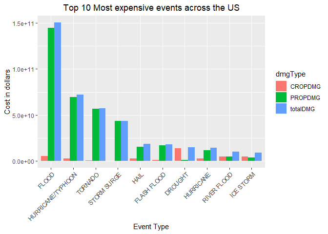

# An overview of the effects of severe weather events on public health and the economy.

Project for the Reproducible Research course.

## Goal Description

The goal of this assignment is to explore the NOAA Storm Database and answer some basic questions about severe weather events.

Questions:

1. Across the United States, which types of events (as indicated in the EVTYPE variable) are most harmful with respect to population health?

2. Across the United States, which types of events have the greatest economic consequences?

Some of the key findings are answered with the following graphs. 

<!-- -->

<!-- -->

## About the files and publication on rpubs

This repository includes the md file (repRes_courseProject2.md) where the complete process of analysis, treatment and outcome description can be visualized. It is also possible to view this document on the rpubs platform, at this [link](https://rpubs.com/imarivero/932356).

Some of the key results 