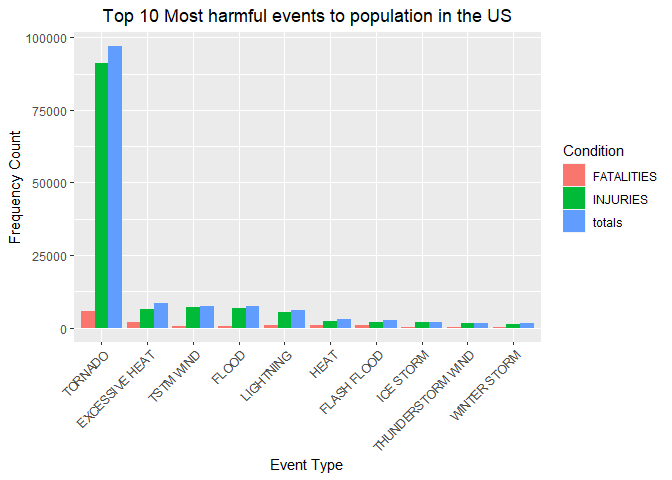

## 1. Synopsis

Storms and other severe weather events can cause both public health and economic problems for communities and municipalities. Many severe events can result in fatalities, injuries, and property damage, and preventing such outcomes to the extent possible is a key concern.

**This project involves exploring the U.S. National Oceanic and Atmospheric Administration's (NOAA) storm database. This database tracks characteristics of major storms and weather events in the United States, including when and where they occur, as well as estimates of any fatalities, injuries, and property damage. The objective of this analysis is to successfully answer two questions (described below) using the data.**

* [National Weather Service Storm Data Documentation](https://d396qusza40orc.cloudfront.net/repdata%2Fpeer2_doc%2Fpd01016005curr.pdf)

* National Climatic Data Center Storm Events [FAQ](https://d396qusza40orc.cloudfront.net/repdata%2Fpeer2_doc%2FNCDC%20Storm%20Events-FAQ%20Page.pdf)

## 2. Goal Description

The goal of this assignment is to explore the NOAA Storm Database and answer some basic questions about severe weather events.

Questions:

1. Across the United States, which types of events (as indicated in the EVTYPE variable) are most harmful with respect to population health?
    
2. Across the United States, which types of events have the greatest economic consequences?

## 3. Data Processing


```r
# Loading Libraries
library(data.table)
library(dplyr)
```

```
## 
## Attaching package: 'dplyr'
```

```
## The following objects are masked from 'package:data.table':
## 
##     between, first, last
```

```
## The following objects are masked from 'package:stats':
## 
##     filter, lag
```

```
## The following objects are masked from 'package:base':
## 
##     intersect, setdiff, setequal, union
```

```r
library(tidyr)
library(ggplot2)
```

### 3.1 Data Loading

Downloading the raw data file, and loading it to a dataframe


```r
# Getting and loading the data
if(!file.exists("./data")){dir.create("./data")}
url <- "https://d396qusza40orc.cloudfront.net/repdata%2Fdata%2FStormData.csv.bz2"
if(!file.exists("./data/stormdata.csv.bz2")){download.file(url, "./data/stormdata.csv.bz2")}
stormData <- as_tibble(read.csv("./data/stormdata.csv.bz2"))
```

### 3.2 Exploring the dataframe


```r
colnames(stormData)
```

```
##  [1] "STATE__"    "BGN_DATE"   "BGN_TIME"   "TIME_ZONE"  "COUNTY"    
##  [6] "COUNTYNAME" "STATE"      "EVTYPE"     "BGN_RANGE"  "BGN_AZI"   
## [11] "BGN_LOCATI" "END_DATE"   "END_TIME"   "COUNTY_END" "COUNTYENDN"
## [16] "END_RANGE"  "END_AZI"    "END_LOCATI" "LENGTH"     "WIDTH"     
## [21] "F"          "MAG"        "FATALITIES" "INJURIES"   "PROPDMG"   
## [26] "PROPDMGEXP" "CROPDMG"    "CROPDMGEXP" "WFO"        "STATEOFFIC"
## [31] "ZONENAMES"  "LATITUDE"   "LONGITUDE"  "LATITUDE_E" "LONGITUDE_"
## [36] "REMARKS"    "REFNUM"
```

```r
str(stormData)
```

```
## tibble [902,297 × 37] (S3: tbl_df/tbl/data.frame)
##  $ STATE__   : num [1:902297] 1 1 1 1 1 1 1 1 1 1 ...
##  $ BGN_DATE  : chr [1:902297] "4/18/1950 0:00:00" "4/18/1950 0:00:00" "2/20/1951 0:00:00" "6/8/1951 0:00:00" ...
##  $ BGN_TIME  : chr [1:902297] "0130" "0145" "1600" "0900" ...
##  $ TIME_ZONE : chr [1:902297] "CST" "CST" "CST" "CST" ...
##  $ COUNTY    : num [1:902297] 97 3 57 89 43 77 9 123 125 57 ...
##  $ COUNTYNAME: chr [1:902297] "MOBILE" "BALDWIN" "FAYETTE" "MADISON" ...
##  $ STATE     : chr [1:902297] "AL" "AL" "AL" "AL" ...
##  $ EVTYPE    : chr [1:902297] "TORNADO" "TORNADO" "TORNADO" "TORNADO" ...
##  $ BGN_RANGE : num [1:902297] 0 0 0 0 0 0 0 0 0 0 ...
##  $ BGN_AZI   : chr [1:902297] "" "" "" "" ...
##  $ BGN_LOCATI: chr [1:902297] "" "" "" "" ...
##  $ END_DATE  : chr [1:902297] "" "" "" "" ...
##  $ END_TIME  : chr [1:902297] "" "" "" "" ...
##  $ COUNTY_END: num [1:902297] 0 0 0 0 0 0 0 0 0 0 ...
##  $ COUNTYENDN: logi [1:902297] NA NA NA NA NA NA ...
##  $ END_RANGE : num [1:902297] 0 0 0 0 0 0 0 0 0 0 ...
##  $ END_AZI   : chr [1:902297] "" "" "" "" ...
##  $ END_LOCATI: chr [1:902297] "" "" "" "" ...
##  $ LENGTH    : num [1:902297] 14 2 0.1 0 0 1.5 1.5 0 3.3 2.3 ...
##  $ WIDTH     : num [1:902297] 100 150 123 100 150 177 33 33 100 100 ...
##  $ F         : int [1:902297] 3 2 2 2 2 2 2 1 3 3 ...
##  $ MAG       : num [1:902297] 0 0 0 0 0 0 0 0 0 0 ...
##  $ FATALITIES: num [1:902297] 0 0 0 0 0 0 0 0 1 0 ...
##  $ INJURIES  : num [1:902297] 15 0 2 2 2 6 1 0 14 0 ...
##  $ PROPDMG   : num [1:902297] 25 2.5 25 2.5 2.5 2.5 2.5 2.5 25 25 ...
##  $ PROPDMGEXP: chr [1:902297] "K" "K" "K" "K" ...
##  $ CROPDMG   : num [1:902297] 0 0 0 0 0 0 0 0 0 0 ...
##  $ CROPDMGEXP: chr [1:902297] "" "" "" "" ...
##  $ WFO       : chr [1:902297] "" "" "" "" ...
##  $ STATEOFFIC: chr [1:902297] "" "" "" "" ...
##  $ ZONENAMES : chr [1:902297] "" "" "" "" ...
##  $ LATITUDE  : num [1:902297] 3040 3042 3340 3458 3412 ...
##  $ LONGITUDE : num [1:902297] 8812 8755 8742 8626 8642 ...
##  $ LATITUDE_E: num [1:902297] 3051 0 0 0 0 ...
##  $ LONGITUDE_: num [1:902297] 8806 0 0 0 0 ...
##  $ REMARKS   : chr [1:902297] "" "" "" "" ...
##  $ REFNUM    : num [1:902297] 1 2 3 4 5 6 7 8 9 10 ...
```
### 3.3 Subsetting dataframe

It is not necessary to use all the variables to perform this analysis. So I will make a subset of the dataframe.


```r
stormData <- stormData %>% select(EVTYPE, # Type of event
                                  FATALITIES,
                                  INJURIES,
                                  PROPDMG, # Property damage
                                  PROPDMGEXP, # Exponent associate with PROPDMG
                                  CROPDMG, # Crop damage
                                  CROPDMGEXP) # Exponent associate with CROPDMG
```

### 3.4 Creating and transforming variables

Analyzing the damage cost of the events, it's necessary to convert the exponent columns to actual exponents and convert the columns of PROPDMG and CROPDMG to the complete decimal value.


```r
unique(stormData$PROPDMGEXP)
```

```
##  [1] "K" "M" ""  "B" "m" "+" "0" "5" "6" "?" "4" "2" "3" "h" "7" "H" "-" "1" "8"
```

```r
unique(stormData$CROPDMGEXP)
```

```
## [1] ""  "M" "K" "m" "B" "?" "0" "k" "2"
```
Here we can see the unique values for the character expression of the exponents associate with the damage cost.

---

To reassign the correct values, I will first create two new dataframes, relating the expressions in characters that we had with exponents in scientific notation. Then by doing a join between both sets, we will have the column with scientific notation in the original dataframe.


```r
# Creating two dataframes to join
propDF <- data.frame(PROPDMGEXP = c("\"\"",
                                        "-",
                                        "+",
                                        "0",
                                        "1",
                                        "2",
                                        "3",
                                        "4",
                                        "5",
                                        "6",
                                        "7",
                                        "8",
                                        "9",
                                        "H",
                                        "K",
                                        "M",
                                        "B"),
                       prop_dec_exp = c(10^0,
                                        10^0, 
                                        10^0,
                                        10^0,
                                        10^1,
                                        10^2,
                                        10^3,
                                        10^4,
                                        10^5,
                                        10^6,
                                        10^7,
                                        10^8,
                                        10^9,
                                        10^2,
                                        10^3,
                                        10^6,
                                        10^9))

cropDF <- data.frame(CROPDMGEXP = c("\"\"",
                                        "?",
                                        "0",
                                        "K",
                                        "M",
                                        "B"),
                       crop_dec_exp = c(10^0,
                                        10^0,
                                        10^0,
                                        10^3,
                                        10^6,
                                        10^9))

stormData <- full_join(stormData, propDF, by="PROPDMGEXP")
stormData <- full_join(stormData, cropDF, by="CROPDMGEXP")
stormData <- drop_na(stormData, EVTYPE) # Dropping NAs generated from join
```

Using the columns with scientific notation, I will multiply the values of PROPDMG and CROPDMG by their exponent, respectively, and reassign the full decimal value to them.


```r
# Reassigning the complete decimal value to PROPDMG and CROPDMG
stormData <- stormData %>% mutate(PROPDMG = PROPDMG * prop_dec_exp,
                                      CROPDMG = CROPDMG * crop_dec_exp)


## Converting NAs to zero, and finally re-selecting the important columns
stormData <- stormData %>% mutate(PROPDMG = case_when(is.na(PROPDMG) ~ 0,
                                                          TRUE ~ PROPDMG
                                                          ),
                                      CROPDMG = case_when(is.na(CROPDMG) ~ 0,
                                                          TRUE ~ CROPDMG
                                                          )
                                      ) %>% 
                           select(EVTYPE, PROPDMG, CROPDMG, INJURIES, FATALITIES)
```

#### Calculating total damage cost per event


```r
stormData <- stormData %>% mutate(totalDMG = PROPDMG + CROPDMG)
stormData
```

```
## # A tibble: 902,297 × 6
##    EVTYPE  PROPDMG CROPDMG INJURIES FATALITIES totalDMG
##    <chr>     <dbl>   <dbl>    <dbl>      <dbl>    <dbl>
##  1 TORNADO   25000       0       15          0    25000
##  2 TORNADO    2500       0        0          0     2500
##  3 TORNADO   25000       0        2          0    25000
##  4 TORNADO    2500       0        2          0     2500
##  5 TORNADO    2500       0        2          0     2500
##  6 TORNADO    2500       0        6          0     2500
##  7 TORNADO    2500       0        1          0     2500
##  8 TORNADO    2500       0        0          0     2500
##  9 TORNADO   25000       0       14          1    25000
## 10 TORNADO   25000       0        0          0    25000
## # … with 902,287 more rows
```

---

Additionally, there were events that did not result in any deaths or injuries. So, these will be removed into a new subset.


```r
fat_inj <- filter(stormData, !(FATALITIES == 0 & INJURIES == 0))
```

#### Calculating total fatalities and injuries per event 


```r
fat_inj <- fat_inj %>% mutate(totals = INJURIES + FATALITIES)
fat_inj
```

```
## # A tibble: 21,929 × 7
##    EVTYPE  PROPDMG CROPDMG INJURIES FATALITIES totalDMG totals
##    <chr>     <dbl>   <dbl>    <dbl>      <dbl>    <dbl>  <dbl>
##  1 TORNADO   25000       0       15          0    25000     15
##  2 TORNADO   25000       0        2          0    25000      2
##  3 TORNADO    2500       0        2          0     2500      2
##  4 TORNADO    2500       0        2          0     2500      2
##  5 TORNADO    2500       0        6          0     2500      6
##  6 TORNADO    2500       0        1          0     2500      1
##  7 TORNADO   25000       0       14          1    25000     15
##  8 TORNADO 2500000       0        3          0  2500000      3
##  9 TORNADO 2500000       0        3          0  2500000      3
## 10 TORNADO  250000       0       26          1   250000     27
## # … with 21,919 more rows
```

## 4. Results

### 4.1 Across the United States, which types of events (as indicated in the EVTYPE variable) are most harmful with respect to population health?

Aggregating each fatality, injury and total by EVTYPE, to have unique values of event types. And rejoining them into a new dataframe.


```r
# Aggregating 
tmp1 <- aggregate(INJURIES ~ EVTYPE, fat_inj, sum) # Sum of injuries caused by the same type of event
tmp2 <- aggregate(FATALITIES ~ EVTYPE, fat_inj, sum) # Sum of fatalities caused by the same type of event
tmp3 <- aggregate(totals ~ EVTYPE, fat_inj, sum) # # Sum of total injuries + fatalities caused by the same type of event

# Performing the join using the temporary tables to create the final dataframe
agg_data <- full_join(tmp1, tmp2, by = "EVTYPE")
agg_data <- full_join(agg_data, tmp3, by = "EVTYPE")
as_tibble(agg_data)
```

```
## # A tibble: 220 × 4
##    EVTYPE           INJURIES FATALITIES totals
##    <chr>               <dbl>      <dbl>  <dbl>
##  1 AVALANCE                0          1      1
##  2 AVALANCHE             170        224    394
##  3 BLACK ICE              24          1     25
##  4 BLIZZARD              805        101    906
##  5 blowing snow            1          1      2
##  6 BLOWING SNOW           13          1     14
##  7 BRUSH FIRE              2          0      2
##  8 COASTAL FLOOD           2          3      5
##  9 Coastal Flooding        0          2      2
## 10 COASTAL FLOODING        0          1      1
## # … with 210 more rows
```

Rearrange in a decreasing order, and extract the first 10 values, which would be the ones with the highest values.


```r
agg_data <- arrange(agg_data, desc(totals)) # reordering
agg_data <- agg_data[1:10,] # Taking only the top 10
as_tibble(agg_data)
```

```
## # A tibble: 10 × 4
##    EVTYPE            INJURIES FATALITIES totals
##    <chr>                <dbl>      <dbl>  <dbl>
##  1 TORNADO              91346       5633  96979
##  2 EXCESSIVE HEAT        6525       1903   8428
##  3 TSTM WIND             6957        504   7461
##  4 FLOOD                 6789        470   7259
##  5 LIGHTNING             5230        816   6046
##  6 HEAT                  2100        937   3037
##  7 FLASH FLOOD           1777        978   2755
##  8 ICE STORM             1975         89   2064
##  9 THUNDERSTORM WIND     1488        133   1621
## 10 WINTER STORM          1321        206   1527
```

Finally, I will make a reshape of the data by making a pivot and reorganizing the values into a new layout.


```r
agg_data <- pivot_longer(agg_data, cols = 2:4, names_to = "Condition", 
                     values_to = "Value")
agg_data
```

```
## # A tibble: 30 × 3
##    EVTYPE         Condition  Value
##    <chr>          <chr>      <dbl>
##  1 TORNADO        INJURIES   91346
##  2 TORNADO        FATALITIES  5633
##  3 TORNADO        totals     96979
##  4 EXCESSIVE HEAT INJURIES    6525
##  5 EXCESSIVE HEAT FATALITIES  1903
##  6 EXCESSIVE HEAT totals      8428
##  7 TSTM WIND      INJURIES    6957
##  8 TSTM WIND      FATALITIES   504
##  9 TSTM WIND      totals      7461
## 10 FLOOD          INJURIES    6789
## # … with 20 more rows
```

Creating the bar plot to answer the question.


```r
ggplot(agg_data, aes(x = reorder(EVTYPE, -Value), y = Value)) +
    geom_bar(stat="identity", aes(fill = Condition), position="dodge") +
    ylab("Frequency Count") +
    xlab("Event Type") +
    theme(axis.text.x = element_text(angle=45, hjust=1)) +
    ggtitle("Top 10 Most harmful events to population in the US") + theme(plot.title = element_text(hjust = 0.5))
```

<!-- -->

As we can see in the graph generated, the events that caused the most human suffering are tornadoes, followed far behind by all the others starting with excessive heat.

---

### 4.2 Across the United States, which types of events have the greatest economic consequences?

Aggregating each damage type, including the total sum of both by EVTYPE, to have unique values of event types. And rejoining them into a new dataframe.


```r
economCons <- select(stormData, EVTYPE, PROPDMG, CROPDMG, totalDMG)

tmp1 <- aggregate(PROPDMG ~ EVTYPE, economCons, sum) # Sum of property damage caused by the same type of event
tmp2 <- aggregate(CROPDMG ~ EVTYPE, economCons, sum) # Sum of crop damage caused by the same type of event
tmp3 <- aggregate(totalDMG ~ EVTYPE, economCons, sum) # # Sum of total prop + crop caused by the same type of event

economCons <- full_join(tmp1, tmp2, by = "EVTYPE")
economCons <- full_join(economCons, tmp3, by = "EVTYPE")

as_tibble(economCons)
```

```
## # A tibble: 985 × 4
##    EVTYPE                  PROPDMG CROPDMG totalDMG
##    <chr>                     <dbl>   <dbl>    <dbl>
##  1 "   HIGH SURF ADVISORY"  200000       0   200000
##  2 " COASTAL FLOOD"              0       0        0
##  3 " FLASH FLOOD"            50000       0    50000
##  4 " LIGHTNING"                  0       0        0
##  5 " TSTM WIND"            8100000       0  8100000
##  6 " TSTM WIND (G45)"         8000       0     8000
##  7 " WATERSPOUT"                 0       0        0
##  8 " WIND"                       0       0        0
##  9 "?"                        5000       0     5000
## 10 "ABNORMAL WARMTH"             0       0        0
## # … with 975 more rows
```

Rearrange in a decreasing order, and extract the first 10 values, which would be the ones with the highest values.


```r
economCons <- arrange(economCons, desc(totalDMG)) # reordering
economCons <- economCons[1:10,] # Taking the top 10
as_tibble(economCons)
```

```
## # A tibble: 10 × 4
##    EVTYPE                  PROPDMG     CROPDMG      totalDMG
##    <chr>                     <dbl>       <dbl>         <dbl>
##  1 FLOOD             144657709800   5661968450 150319678250 
##  2 HURRICANE/TYPHOON  69305840000   2607872800  71913712800 
##  3 TORNADO            56935880674.   414953270  57350833944.
##  4 STORM SURGE        43323536000         5000  43323541000 
##  5 HAIL               15730367456.  3025537470  18755904926.
##  6 FLASH FLOOD        16822673772.  1421317100  18243990872.
##  7 DROUGHT             1046106000  13972566000  15018672000 
##  8 HURRICANE          11868319010   2741910000  14610229010 
##  9 RIVER FLOOD         5118945500   5029459000  10148404500 
## 10 ICE STORM           3944927860   5022113500   8967041360
```

Finally, I will make a reshape of the data by making a pivot and reorganizing the values into a new layout.


```r
economCons <- pivot_longer(economCons, cols = 2:4, names_to = "dmgType",
                           values_to = "costValue")
as_tibble(economCons)
```

```
## # A tibble: 30 × 3
##    EVTYPE            dmgType      costValue
##    <chr>             <chr>            <dbl>
##  1 FLOOD             PROPDMG  144657709800 
##  2 FLOOD             CROPDMG    5661968450 
##  3 FLOOD             totalDMG 150319678250 
##  4 HURRICANE/TYPHOON PROPDMG   69305840000 
##  5 HURRICANE/TYPHOON CROPDMG    2607872800 
##  6 HURRICANE/TYPHOON totalDMG  71913712800 
##  7 TORNADO           PROPDMG   56935880674.
##  8 TORNADO           CROPDMG     414953270 
##  9 TORNADO           totalDMG  57350833944.
## 10 STORM SURGE       PROPDMG   43323536000 
## # … with 20 more rows
```

Creating the bar plot to answer the question.


```r
ggplot(economCons, aes(x = reorder(EVTYPE, -costValue), y = costValue)) +
    geom_bar(stat="identity", aes(fill = dmgType), position="dodge") +
    ylab("Cost in dollars") +
    xlab("Event Type") +
    theme(axis.text.x = element_text(angle=45, hjust=1)) +
    ggtitle("Top 10 Most expensive events across the US") + theme(plot.title = element_text(hjust = 0.5))
```

<!-- -->
As we can see in the graph generated, the costliest events have been floods, followed by hurricanes and tornadoes.

---
## 5. Conclusion 
From the analysis of this dataset, we can simply conclude that those ecological disasters that cause the most damage to people are not always the costliest, but the emotional costs they cause should also be considered.
